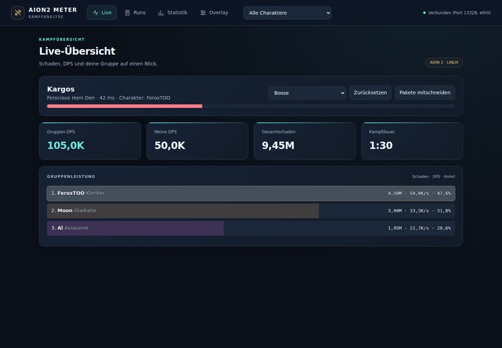

# AION2 Meter

Eigenständiger Damage Meter für **AION 2 unter Linux** (Zielplattform: Fedora mit KDE Plasma, Wayland).
Er liest den Netzwerkverkehr des Spiels mit, zeigt ein **Overlay im Spiel** und speichert jede
**Expedition** mit Gruppe und Bosskämpfen in einer **SQLite-Datenbank**, die du im Browser auswerten kannst.

| | |
|---|---|
| **Overlay** | Kleines, transparentes Fenster über dem Spiel: Ziel mit HP-Balken, Kampfzeit, Gruppen-DPS, pro Spieler Schaden, DPS und Anteil (Klassenfarben, du bist gold umrandet), Ping und aktueller Dungeon. |
| **Dashboard** | `http://127.0.0.1:8787/` im Browser: Live-Meter, alle Runs mit Gruppe und Bossen, Skill-Aufschlüsselung pro Kampf (Krit/Rücken/Perfekt), Statistiken. |
| **Statistik** | **Top 5 Mitspieler**, mit denen du am häufigsten in Expeditionen warst, Runs pro Dungeon mit Bestzeit, deine beste DPS pro Boss, Aktivität der letzten 30 Tage. |
| **Datenbank** | `~/.local/share/aion2-meter/meter.db` (SQLite). Ein Run beginnt beim Betreten einer Instanz und endet beim Verlassen. |

Kein Discord und kein Account. Kampf- und Personendaten bleiben lokal; nur die ausdrücklich ausgelöste Updateprüfung fragt GitHub ab. Exporte teilst du selbst.

## Neu in 0.3.1

Einheitliche Zeitfenster auch bei kurzen Kämpfen, sichere Speicherung beim regulären Beenden, korrigierte Overlay-Skalierung mit stabiler Position und Updateinstallation bei laufendem Meter. Skilldetails haben Suche, Sortierung, Durchschnitt, Anteil und Skill-DPS/HPS; zusätzliche Treffermerkmale sind auf Wunsch sichtbar. Statushilfen erklären fehlende Pakete. Laufende Runs können nicht gelöscht werden, Bossstatistiken trennen Schwierigkeitsgrade und zählen erfasste Versuche.

[Releaseprüfung und Testmatrix](docs/RELEASE_REVIEW_0.3.1.md) · [Noch offene reale Ingame-Abnahme](docs/INGAME_ACCEPTANCE.md).

**Stand der Abnahme:** Softwaretests und synthetische Messfälle sind geprüft; reale AION-2-Korrektheit und KDE/Wayland-Verhalten sind noch nicht final verifiziert. Einzelne Parser-Skills verwenden begrenzte 32-Bit-Summen. Das Dashboard warnt bei erkennbaren Zahlengrenzen.

## Neu in 0.3.0

Aktualisierter A2Tools-Parser 2.0.52, optionale Leerlauf-/Wipe-Resets mit vorherigem Speichern, PNG-Berichte und Chatzeilen, zwei Spieler nebeneinander, gemeinsame Gruppen-DPS-Kurven, zusätzliche Treffermerkmale und drei Designs mit kompakter Ansicht. [Funktionsgrenzen und Ingame-Messvergleich](docs/QOL_0.3.0.md).

Fertige Linux-Pakete entstehen in GitHub Actions als `aion2-meter-linux-packages`. Nach Freigabe durch den Maintainer erscheinen sie unter [Releases](https://github.com/feroxtwo/damage-meter/releases). Für Ubuntu/Debian: `.deb`, Fedora: `.rpm`, Bazzite: `.rpm` per `rpm-ostree install` und Neustart. Alternativ das Linux-Archiv entpacken und `./scripts/install-binary.sh` ausführen, ohne Rust/Node. Einstellungen und Kämpfe bleiben beim Update erhalten. KWin-/Shortcut-Einrichtung für Systempakete siehe Funktionsdokumentation.

Im Dashboard unter **Overlay → Version und Updates** lässt sich GitHub auf Klick prüfen. Ohne veröffentlichtes Release gibt es noch keinen Download über diesen Weg.

Archivinstallation setzt die nativen Grafik-/Tastaturbibliotheken voraus. Debian/Ubuntu: `sudo apt install libxkbcommon0 libxkbcommon-x11-0 libegl1 libgl1 libcap2-bin xdg-utils`. Fedora: `sudo dnf install libxkbcommon libxkbcommon-x11 libglvnd-egl libglvnd-glx libcap xdg-utils`. Systempakete deklarieren diese Abhängigkeiten automatisch.

## Installation (Fedora / KDE)

**Fedora Workstation / KDE Spin:**

```bash
sudo dnf install rust cargo gcc git libxkbcommon libxkbcommon-x11 libglvnd-egl libglvnd-glx xdg-utils
git clone https://github.com/feroxtwo/damage-meter.git
cd damage-meter
./scripts/install.sh
```

**Bazzite, Kinoite, Silverblue (rpm-ostree):** `dnf` funktioniert dort nicht. Rust kommt ohne root über rustup,
der Rest ist schon an Bord:

```bash
curl --proto '=https' --tlsv1.2 -sSf https://sh.rustup.rs | sh
git clone https://github.com/feroxtwo/damage-meter.git
cd damage-meter
./scripts/install.sh
```

Das Skript lädt `~/.cargo/env` selbst, ein neues Terminal nach rustup ist also nicht nötig.

> Solange das Repository **privat** ist, braucht `git clone` eine Anmeldung: entweder `gh auth login` und dann
> `gh repo clone feroxtwo/damage-meter`, oder auf GitHub *Code → Download ZIP* und das Archiv entpacken.

Das Skript

1. baut das Programm (`cargo build --release`, beim ersten Mal einige Minuten),
2. installiert es nach `~/.local/bin/aion2-meter` mit Startmenü-Einträgen „AION2 Meter“ und „AION2 Meter Dashboard“,
3. erlaubt ihm per `sudo setcap cap_net_raw=ep` den Paketmitschnitt (der Meter selbst läuft **nicht** als root),
4. legt unter KDE eine **KWin-Fensterregel** an, damit das Overlay über dem Spiel bleibt,
5. fragt, ob es die **Tastenkürzel** einrichten soll (siehe unten).

Nach einem Update (`git pull && ./scripts/install.sh`) wird `setcap` erneut ausgeführt, weil eine neu gebaute Datei die Berechtigung verliert. Beende danach die laufende alte Version und starte das Meter neu. Die Datei wird atomar ersetzt; Einstellungen und Historie bleiben in deinem Benutzerverzeichnis.

## Benutzung

1. AION 2 über Steam/Proton starten, am besten **randloses Fenster** oder **Fenstermodus**.
2. „AION2 Meter“ starten. Unten im Overlay zeigt ein Punkt den Zustand:
   grau = Spiel nicht gefunden, gelb = suche Verbindung, grün = verbunden.
3. Kämpfen. Bosskämpfe werden automatisch gespeichert, Runs beim Verlassen der Instanz abgeschlossen.

**Overlay bedienen:** Kopfzeile ziehen zum Verschieben, Symbole unten rechts: Mitschnitt, Zurücksetzen, Ausblenden, Sperren. Rechtsklick für Menü (Zurücksetzen, Ziel-Modus,
Sperren, Dashboard, Beenden). Klappt das Ziehen nicht, geht es unter KDE immer mit **Meta (Windows-Taste) +
Linksziehen**. **Gesperrt** gehen alle Klicks durch ans Spiel. Entsperren geht über das Dashboard (Tab „Overlay“)
oder ein Tastenkürzel.

**Tastenkürzel:** Wayland erlaubt Programmen keine eigenen globalen Hotkeys, deshalb registriert
`./scripts/install-shortcuts.sh` sie bei KDE (sofort aktiv, kein Neustart):

| Standard | Befehl | Wirkung |
|---|---|---|
| Strg+Umschalt+F9 | `~/.local/bin/aion2-meter ctl toggle-lock` | Overlay sperren / entsperren |
| Strg+Umschalt+F10 | `~/.local/bin/aion2-meter ctl toggle-visible` | Overlay ein- / ausblenden |
| Strg+Umschalt+F11 | `~/.local/bin/aion2-meter ctl reset` | Live-Meter zurücksetzen |

Andere Tasten: `LOCK=Strg+Ü VISIBLE=Strg+Ö RESET=Strg+Ä ./scripts/install-shortcuts.sh`. Entfernen:
`./scripts/install-shortcuts.sh --remove`. Danach lassen sie sich auch unter *Systemeinstellungen → Tastatur →
Kurzbefehle* ändern.

`~/.local/bin/aion2-meter ctl status` zeigt, ob das Overlay sichtbar und gesperrt ist und ob der Meter mit dem
Spiel verbunden ist, ohne etwas umzuschalten.

**Mehrere Charaktere:** Jeder Run merkt sich, mit welchem Charakter du gespielt hast. Oben im Dashboard
filtert eine Auswahl Runs und Statistik (Top-Mitspieler, DPS-Verlauf, Bestwerte) auf einen Charakter oder
zeigt alle zusammen. Deine eigenen Charaktere zählen nie als Mitspieler.

### Buffs, Debuffs und Mitschnitt

Bei jedem gespeicherten Bosskampf (Runs → Kampf → Skills) steht, wie lange jeder Spieler welche Buffs hatte
und welche Debuffs wie lange auf dem Boss lagen, jeweils in Prozent der Kampfzeit. Das Buff-Paket ist aus den
offenen Metern NOIA2 und AIon2-Dps-Meter übernommen.

Ausweichen und nDPS sind hier noch nicht implementiert. Für weitere Parserarbeit schneidet
der Haken „Pakete mitschneiden“ (Overlay-Menü per Rechtsklick oder Dashboard-Tab „Overlay“, alternativ
`~/.local/bin/aion2-meter ctl record`) die Spielverbindung mit. Der Haken bleibt nach einem Neustart gesetzt,
bis du ihn entfernst; über 2 GB werden die ältesten Mitschnitte gelöscht. Die Dateien (`*.a2mcap`, rohe TCP-Daten der Spielverbindung
mit Zeitstempel) landen in `~/.local/share/aion2-meter/captures/`. Sie enthalten alles, was der Server
deinem Client schickt, also auch Chat und Namen: nur weitergeben, wem du das zeigen willst.

### Kampfanalyse und Komfort (0.2.0)

- **Overlay:** Einstellungen und Position bleiben nach Neustarts erhalten. Benannte Profile, eigene Zeile trotz Top-N-Limit, Auswahl Schaden/Heilung/erlittener Schaden und „Overlay zurückholen“ im Dashboard. Klick auf einen Spieler im entsperrten nativen Overlay öffnet dessen Details im Browser.
- **Live:** Schadens- und Heilungsranglisten, Spielerdetails und eigene 5s-Burst-DPS. Heilung wird seit dem letzten Parser-Reset erfasst, einschließlich Selbstheilung. HPS teilt diese erfasste Heilung durch die angezeigte Kampfdauer. Es ist keine effektive Heilung und kein Overheal-Abzug.
- **Kampfbibliothek:** Unter Runs nach Boss, Notiz, Tags, Datum und Charakter suchen. Kämpfe als Favoriten markieren. Auch Trainingskämpfe und Kämpfe ohne Run-Zuordnung erscheinen hier.
- **Vergleich:** Zwei Kämpfe desselben Bosses und derselben Schwierigkeit vergleichen. Eigene DPS, Dauer, Skill-Schaden, Kritrate und Buff-Uptime werden bei gleichem Charakter und gleicher Klasse gegenübergestellt.
- **Zeitlinien:** Trefferzeitpunkte, Buff-Intervalle, Ping und beobachtete DPS-Kurven. Schaden wird alle 500 ms beobachtet, nicht künstlich auf einzelne Treffer verteilt. Alte Kämpfe ohne gespeicherte Zeitdaten bleiben lesbar.
- **Teilen:** Rangliste kopieren, CSV/JSON herunterladen. Kampffile-Exporte anonymisieren Namen standardmäßig und enthalten keine Notizen, Netzwerkadressen oder internen Charakter-IDs.
- **Training:** 1/3/5 Minuten, Start beim ersten Treffer nach dem Reset, Abschlussbericht und persönliche Bestwerte je Charakter, Ziel und Testdauer. Die tatsächlich beobachtete Dauer wird angezeigt. Zielwechsel, Reset oder Verbindungsende unterbrechen das Training.

**Offline-Replay**, ohne Spiel, Overlay oder Capture-Berechtigung:

```bash
aion2-meter replay ~/.local/share/aion2-meter/captures/aion2-123.a2mcap --output analyse.json
```

Neue Aufnahmen verwenden `A2MCAP3`: Paketzeit, Richtung, IPs, Ports, Interface, TCP-Sequenz/ACK und die rohen Payload-Bytes bleiben erhalten (v2 schrieb die Payload als JSON-Zahlenliste und war drei- bis viermal so groß). `A2MCAP2` wird weiter gelesen, alte `A2MCAP1`-Aufnahmen ebenfalls, können aber TCP-Reordering nicht reproduzieren. Springt die Systemuhr während der Aufnahme zurück, hält Replay die Zeit an statt abzubrechen. `clock_steps_back` zählt rückwärts laufende Zeitstempel gegenüber dem vorherigen Paket; `clock_clamped_packets` zählt alle Pakete, deren Zeit dabei angeglichen wurde. Abgeschnittene oder ungültige Dateien werden abgewiesen. Replay verwendet eine isolierte In-Memory-Datenbank und verändert die gespeicherten Live-Kämpfe nicht.

Die TCP-Sortierung puffert bis 2 MiB beziehungsweise 2048 Segmente. Bei einer beobachteten Lücke über zwei Sekunden oder einem überschrittenen Limit beginnt sie mit verfügbaren Daten neu und meldet die Lücke. Nicht aufgenommene Bytes lassen sich nicht rekonstruieren.

[Technische Details und Testumfang](docs/COMBAT_ANALYSIS.md).

### Optionen

```
aion2-meter [--no-overlay] [--x11] [--port 8787] [--listen 127.0.0.1] [--lang de|en] [--db PFAD] [--any-process] [--record]
```

- `--no-overlay` nur Mitschnitt + Dashboard (z. B. Dashboard auf zweitem Monitor).
- `--x11` Overlay über XWayland, dort klappt „immer im Vordergrund“ auch ohne KWin-Regel.
- `--listen 0.0.0.0` Dashboard im Heimnetz erreichbar (Handy, Zweit-PC). Ohne Passwort, also nur im eigenen Netz.
- `--lang en` Skill- und Monsternamen auf Englisch.
- `--any-process` nicht auf einen `AION2.exe`-Prozess warten (z. B. Spiel in VM/Container).
- `--record` gleich beim Start mitschneiden (siehe oben).
- `/overlay` im Dashboard ist eine Browser-Variante des Overlays, z. B. als OBS-Browserquelle.

## Fehlerbehebung

| Problem | Lösung |
|---|---|
| Overlay rot: „keine Capture-Berechtigung“ | `sudo setcap cap_net_raw=ep ~/.local/bin/aion2-meter` |
| Overlay bleibt grau, obwohl das Spiel läuft | Starte mit `--any-process`. Bleibt es dann gelb, sieht der Meter den Spielverkehr nicht (VPN/Ping-Reducer?). Log mit `RUST_LOG=debug aion2-meter` |
| Overlay verschwindet hinter dem Spiel | Spiel randlos/Fenster statt Vollbild. `./scripts/install-kwin-rule.sh` erneut ausführen, oder in *Systemeinstellungen → Fensterverwaltung → Fensterregeln* für `aion2-meter` „Ebene: Overlay“ erzwingen. Alternativ `aion2-meter --x11`. |
| Overlay lässt sich an der Kopfzeile nicht ziehen | Meta + Linksziehen. Wenn du die KWin-Regel vor Version 0.1.1 installiert hast: `./scripts/install-kwin-rule.sh` erneut ausführen (die alte Regel verbot dem Overlay den Fokus). |
| Overlay hat schwarzen statt transparenten Hintergrund | `aion2-meter --x11` probieren und melden. |
| Nach einem Spiel-Patch kein Schaden mehr | Der Parser stammt aus A2Tools (siehe unten). einen für den Spiel-Patch geprüften Parser-Stand verwenden und neu installieren; ein beliebiger neuer Commit ist kein Korrektheitsnachweis. |

## Wie es funktioniert

```
Netzwerk ──AF_PACKET──▶ capture.rs ──▶ dispatcher.rs ──▶ A2Tools-Parser ──▶ engine.rs ──┬──▶ Overlay (egui)
 (alle Interfaces,        TCP-Payload    erkennt die       (Schaden, Namen,    Live-Werte,  ├──▶ Dashboard (axum, :8787)
  inkl. VPN/tun)                          Spielverbindung   Party, Instanz)     Run-Tracking └──▶ SQLite
```

- **Mitschnitt** direkt über einen `AF_PACKET`-Socket, ohne libpcap. Braucht nur `CAP_NET_RAW`.
- **Protokoll-Parser und Kampfauswertung** kommen aus [A2Tools DPS Meter](https://github.com/taengu/A2Tools-DPS-Meter)
  (GPL-3.0) als Bibliothek, ohne dessen Tauri-Oberfläche. So profitiert dieser Meter direkt von deren
  Anpassungen an Spiel-Patches. Die Datendateien in `data/` (Skill-, NPC- und Dungeon-Namen) stammen ebenfalls von dort.
- **Runs:** Die Instanz-ID kommt aus dem Party-Roster des Spiels. Wechselt sie, endet der alte Run und ein neuer beginnt.
  Die Gruppe eines Runs sind alle Spieler aus dem Roster plus alle, die in einem Bosskampf mit dir Schaden gemacht haben.
  Runs ohne Bosskampf und ohne Mitspieler werden verworfen.

### Datenbank

| Tabelle | Inhalt |
|---|---|
| `runs` | Dungeon, Schwierigkeit, Start, Ende, dein Charakter, Notiz |
| `run_members` | Gruppe pro Run (Klasse, Server, Level, Kampfkraft) |
| `fights` | Bosskämpfe mit Dauer, Gesamtschaden und vollständigem Kampf-Datensatz (JSON) |
| `fight_players` | Schaden, DPS, Anteil, Heilung pro Spieler und Kampf |
| `my_characters` | deine Charaktere (werden aus den Mitspieler-Statistiken ausgenommen) |

Die Datei kann jederzeit mit `sqlite3` oder DB Browser for SQLite geöffnet werden.

## Entwicklung

```bash
cargo test
cargo run -- --no-overlay --any-process   # ohne setcap: Dashboard läuft, Mitschnitt meldet fehlende Berechtigung
```

## Lizenz

GPL-3.0-or-later, wie A2Tools DPS Meter, dessen Parser und Daten dieses Projekt nutzt.
Die Nutzung von Drittanbieter-Tools kann gegen die Nutzungsbedingungen des Spiels verstoßen; Verwendung auf eigenes Risiko.

## Modernisiertes Dashboard und technische Prüfung

Die Live-Ansicht zeigt Gruppen-DPS, eigene DPS, Gesamtschaden und Kampfdauer direkt als Kennzahlen. Runs und Statistik sind auch auf kleinen Bildschirmen bedienbar. Das Browser-Overlay unter `/overlay` berücksichtigt jetzt die gleichen Anzeige- und Streaming-Einstellungen wie das native Overlay.



Befunde, Änderungen, Prüfungen und verbleibende Grenzen stehen in der [technischen Prüfung](docs/TECHNICAL_REVIEW.md).

### Entwicklung prüfen

```bash
cargo fmt --all --check
cargo clippy --locked --all-targets -- -D warnings
cargo test --locked
cargo build --release --locked
python3 scripts/test-headless.py
npm ci
npx playwright install chromium
npm test
```

Node.js (ab Version 20) und Playwright werden ausschließlich für die Browserprüfungen benötigt. Die Anwendung selbst bleibt eine Rust-Binary mit eingebettetem HTML. `Cargo.lock` und `package-lock.json` gehören zum Repo.

Der HTTP-Server akzeptiert `localhost`, Loopback-IP-Adressen und die gebundene IP mit dem richtigen Port. Bei `--listen 0.0.0.0` sind IP-Adressen im Netzwerk erlaubt. Beliebige Domainnamen werden zum Schutz gegen DNS-Rebinding abgewiesen.


### Zeitfenster und Messgrenzen

DPS/HPS verwenden die Zeit vom ersten bis zum letzten erfassten Schaden am Ziel, mindestens eine Sekunde. Leerlauf danach vergrößert dieses Fenster nicht. Run-Gesamt-DPS verwenden die Summe dieser gemeinsamen Kampfzeitfenster; nicht teilgenommene Kämpfe zählen mit null Schaden. Die persönliche DPS in der Run-Liste ist ausdrücklich der Durchschnitt der einzelnen Kämpfe. Burst ist eine eigene gleitende Fünfsekunden-Kennzahl.

Heilung umfasst erfasste Heilung seit Parser-Reset, mit der angezeigten Ziel-Kampfdauer als HPS-Nenner; Overheal wird nicht abgezogen. Buffs beruhen auf Anwendung und gemeldeter Dauer. Frühes Entfernen bleibt unbekannt. Fehlende Treffermerkmale erscheinen als „—“; dies beweist keine null Prozent.

### Zusätzliche Releaseprüfungen

```bash
python3 scripts/test-validation.py
python3 scripts/test-installer.py
python3 scripts/test-native-dependencies.py  # benötigt C-Compiler nur für diesen Test
node scripts/test-real-web.cjs
# Benötigt Xvfb, xdotool und Python Pillow; keine echte Spielsitzung.
python3 scripts/test-native.py
python3 scripts/benchmark-history.py
# Nach scripts/package-linux.sh (RPM-Prüfung benötigt rpm):
python3 scripts/test-packages.py
```

Das Installer-Testskript simuliert den privilegierten setcap-Schritt. Reale Paketinstallation und Capture-Rechte müssen zusätzlich auf dem Zielsystem geprüft werden. Der Kurzbenchmark erzeugt eine isolierte synthetische Historie; er ist kein Langzeit- oder Ingame-Performancebeweis.

Deinstallation: Systempakete mit dem Paketmanager entfernen. Für die Benutzerinstallation zuerst das Meter beenden, mit `./scripts/install-shortcuts.sh --remove` die KDE-Kürzel entfernen und Binary sowie die drei installierten Desktop-/Icon-Dateien unter dem gewählten Prefix löschen. `~/.local/share/aion2-meter/` enthält deine Daten und bleibt erhalten; vor bewusstem Löschen sichern. KWin-Regeln bei Bedarf in der Fensterverwaltung entfernen.
