# Combat Telemetry — Abschluss und technische Abnahme

Basis: aktueller main `f34442c` mit den bereits integrierten Premium- und Gegenprüfungsänderungen einschließlich `deb50cb`. Version bleibt 0.3.1. Umsetzung auf `design/combat-telemetry`, [PR #17](https://github.com/feroxtwo/damage-meter/pull/17). Frühere Abnahmen und deren Grenzen bleiben unter [Premium Combat Experience](PREMIUM-UX-ACCEPTANCE.md) nachvollziehbar.

Nachtrag 8. Oktober 2026: Die zusätzliche [Bereichs-/Expeditionsauswahl für die DPS-Entwicklung](PERFORMANCE_ACTIVITY_FILTERS.md) wird separat in [PR #18](https://github.com/feroxtwo/damage-meter/pull/18) geprüft. Ihre Änderungen und Testergebnisse stehen dort; die folgenden Ergebnisse dokumentieren weiterhin die vorherige Combat-Telemetry-Abnahme.

Das Dashboard `/`, das bestehende native eframe/egui-Fenster und die Browser-/OBS-Ansicht `/overlay` bleiben drei getrennte Oberflächen. Dashboard und natives Fenster können gleichzeitig laufen. Es wurde kein zweites natives Fenster gebaut und kein Datenbankschema geändert.

## Sichtbare und analytische Verbesserungen

Die Live-Ansicht löst die vorherige Folge gleich gewichteter Karten auf. Ein schmaler Combat-Strip verbindet Ziel, HP, Charakter und Kampfzeit. Darunter führt eine asymmetrische Leistungsfläche mit großer eigener Rate, Rang und Gruppenanteil; Gruppenrate und Gesamtsumme sind kompakter. Recording, Reset, Exporte und Diagnose folgen nach den Kampfdaten. Auf kleinen Displays bleibt diese Reihenfolge erhalten.

Die Rangliste verwendet offene Zeilen, zweistellige Rangmarken, Klassenicons, dominante Raten und separate proportionale Klassenbalken. Die eigene Zeile hat einen Goldakzent. Eine kurze Reaktion markiert tatsächliche Rangänderungen; gleichbleibende Live-Updates animieren nicht. Tastaturfokus und reduzierte Bewegung bleiben berücksichtigt. HPS und erlittener Schaden verwenden ihre vorhandenen Kennzahlen und zeigen keinen Damage-Burst-Verlauf.

Vier bestehende Bereiche erhalten eine deutlichere Produktidentität:

1. **Live-Instrument:** eigene Rate und Rang mit beobachtetem Burst-Signal statt gleich großer KPI-Karten.
2. **Kampfbericht:** eigenes Ergebnis, größter Skill-Anteil und anklickbares stärkstes beobachtetes 5s-Fenster führen zum vorhandenen Schadensverlauf. Diagramm, Zeitregler, Glättung, Spieler-/Gruppenauswahl, Treffer/Ticks und Vergleiche bleiben verbunden.
3. **Training:** vorhandene 1/3/5-Minuten-Messung als Instrument mit Zeit, Fortschritt, erfasster Rate, bestätigtem Bestwert und explizitem Abbruchzustand. Der erste Treffer startet weiterhin die Messung.
4. **Natives Kompakt-Overlay:** offenes Ranking, lokale Zahlenunterlagen und vereinfachter Footer im vorhandenen Fenster.

Die Boss-Statistik behält ihre bereits geprüfte persönliche Einordnung gegenüber vorherigen Versuchen. Eigene Leistung erhält mehr Gewicht als begleitende Kennzahlen; die vorhandenen Vergleichbarkeitsgrenzen wurden erhalten. Es wird kein zweites Statistiksystem eingeführt.

## Datenbasis und klare Grenzen

**Live-Signal:** Die Linie zeigt ausschließlich im geöffneten Browser empfangene eigene `burst_dps`-Werte. Sie ist auf 60 Sekunden und höchstens 120 Punkte begrenzt. Ziel-ID, Zielstart und eigene Actor-ID trennen Beobachtungen; ein rückläufiger Kampf-Timer setzt sie zurück. Fehlende/ungültige Werte und Parser-Zahlengrenzen erzeugen keine erfundenen Punkte. Polling-Lücken über drei Sekunden unterbrechen die Linie. Es wird kein historischer Verlauf aus aktuellen Werten rekonstruiert. Eine Nullreihe bleibt als `0/s` bezeichnet; ein unbekannter HP-Wert bleibt unbekannt.

**Gespeicherter Versuch:** Beim Wechsel der Begegnung wird ausschließlich die passende vorhandene `auto_<Ziel-ID>_<Start>`-Aufzeichnung angefragt. ID, Startzeit, Bossname, eigene Actor-ID und Charaktername müssen passen. Veraltete Antworten werden verworfen; bei Charakterwechsel verschwindet die Zusammenfassung. Fehlende Aufzeichnungen erzeugen keinen Ergebnisdialog. „Letzter gespeicherter Versuch“ behauptet weder einen Kill noch ein automatisch erkanntes Kampfende. Öffnen, Peak-Sprung und Ausblenden bleiben direkte Aktionen.

**Training:** Die laufende Rate verwendet erfassten eigenen Schaden und tatsächlich verstrichene Trainingszeit. Das fertige Ergebnis kommt aus den vorhandenen gespeicherten Trainingszeilen. Eine Bestwertreaktion benötigt das bestätigte `personal_best`-Flag; bei erkannten Parser-Zahlengrenzen wird keine exakte Rekordreferenz behauptet. Bestwerte bleiben nach Charakter, Ziel und Dauer getrennt. Ein Abbruch zeigt kein abgeschlossenes Ergebnis. Es werden keine Verbesserungsprozente aus fehlenden Vergleichsdaten abgeleitet.

Für Peaks, Skill-Treffer/Ticks und persönliche Bossvergleiche gelten unverändert die [fachlichen Grenzen der bisherigen Abnahme](PREMIUM-UX-ACCEPTANCE.md#aussagegrenzen). Keine neue Aussage über Overheal, Shields, rDPS, Dispel, nicht beobachtete Buffentfernung oder reale AION-2-Protokollvollständigkeit. DE/EN, stabile Skill-/Effekt-IDs, lokale Icons, unbekannte IDs und gekennzeichnete Community-Namen verwenden dieselben vorhandenen Pfade.

## Bestehendes natives Overlay und OBS

Kompakt bleibt 312 logische Pixel breit, normal 360. Kompakte Zeilen sind 28 Pixel hoch; normale Zeilen 40. Bei fünf Zeilen ergibt das 312 × 198 bzw. 360 × 266 Pixel. Die zusätzliche Zeilenhöhe trennt Namen, Werte und Balken besser. Das normale Layout behält Summe und Anteil; im Kompaktmodus bleibt der Anteil im Tooltip verfügbar. Namen werden weiterhin passend gekürzt und sind entsperrt per Tooltip lesbar. Eigener Rang, eigene Zeile/Pinning, Klassenicon, Tot-Status und echte Balkenverhältnisse bleiben erhalten.

Der Zielheader erhält eine kleine A2-Marke, die eigene Zeile einen goldenen Rangakzent. Nach der Gegenprüfung (siehe unten) tragen eine dunkle Glyphenkontur statt Zahlenunterlagen die Lesbarkeit auf hellen und farbigen Untergründen, ohne die gesamte Fläche undurchsichtig zu machen. Der Footer erscheint nur noch entsperrt (Bedienmodus) oder wenn Capture, Berechtigung, Zahlengrenze, fehlende Verbindung oder ein laufender Mitschnitt Aufmerksamkeit brauchen. Lock/Hide/Reset/Record erscheinen bei Hover im entsperrten Footer; Einstellungen und Kontextbedienung bleiben erhalten.

OBS übernimmt offene Zeilen, dominante Raten, eigenen Akzent und vereinfachten Header. Kompakte Breite ohne den entfernten äußeren Rahmen: 312 Pixel. Es bleibt eine Browserquelle und wird nicht als natives Ingame-Fenster beschrieben.

## Drei tatsächliche Design-/UX-Runden

| Runde | Code und Evidenz | Gezieltes Ergebnis |
|---|---|---|
| 1 | `91f4c74`, [CI #126](https://github.com/feroxtwo/damage-meter/actions/runs/37814053521) | Combat-Strip, Leistungsfläche, Ranking und vorhandener nativer Painter umgebaut. Gerenderte Desktop-/Mobile-/Native-Bilder geprüft. Im nativen Kompaktmodus lagen sekundäre Werte zu nah an der Rate; der 24-Zeilen-Test bei 250 % überschritt den virtuellen Bildschirm. Diese Teilprüfung galt als fehlgeschlagen. |
| 2 | `91b4cd2`, [CI #128](https://github.com/feroxtwo/damage-meter/actions/runs/37815813588) | Kompakte sekundäre Werte in Tooltip verlagert, Zahlenunterlagen verbessert, virtuelle Testfläche auf 1800 × 2400 erweitert. Bericht und gespeicherter Versuch stärker gewichtet. Native-, Rust-, Release- und Installer-Prüfungen bestanden; eine alte OBS-Breitenassertion erwartete noch 314 statt 312 Pixel. |
| 3 | `f2868b6`, [CI #130](https://github.com/feroxtwo/damage-meter/actions/runs/37817877529) und abschließende Gates am PR | Training, Zustände, A2-/Eigenakzent, zugängliche Radioauswahl und gefüllte 90s-Berichtsszenarien ergänzt. OBS-Assertion korrigiert. Abschließend in `d4283f5` ([CI #132](https://github.com/feroxtwo/damage-meter/actions/runs/37818643444)) Nullreihe korrekt beschriftet, Rustformatierung übernommen, visuelle Testzähler angeglichen und temporären Formatierungsschritt entfernt. Finale Ergebnisse siehe Matrix. |

Die Sichtprüfung bewertet Komposition, Hierarchie, Signal-/Ranking-Verbindung, mobile Reihenfolge und Kontrast. Das Ein-Sekunden-Ziel im echten Spiel bleibt eine menschliche Ingame-Prüfung; Screenshots beweisen diese Zeit nicht.

## Release-Abnahmematrix

Stand: 8. Oktober 2026. [CI #130](https://github.com/feroxtwo/damage-meter/actions/runs/37817877529) besteht vollständig. Die abschließende Codeprüfung für `d4283f5` ist [CI #132](https://github.com/feroxtwo/damage-meter/actions/runs/37818643444); verbindlicher Status des nachfolgenden Dokumentationscommits steht in den [PR-Gates](https://github.com/feroxtwo/damage-meter/pull/17/checks).

| Bereich | Tatsächlich ausgeführte Prüfung | Ergebnis |
|---|---|---|
| Rust | `cargo fmt --all --check`, Clippy aller Targets mit `-D warnings`, 92 Tests; Rust 1.88 `cargo check --locked` | Bestanden |
| Analyse / Signal | 37 Assertions: vollständige beobachtete Peaks, Lücken/Reset/Caps, Actor-ID/DoT/Ticks, vergleichbare Klassen und begrenzter lokaler Signalpuffer | Bestanden |
| Skill-/Chart-Daten | 8 Skill-/Sprach-/Export-Prüfbereiche und 9 Chart-/PNG-Prüfbereiche | Bestanden |
| Browserregression | 52 Chromiumfälle einschließlich vorhandener Fälle, gespeicherter Zusammenfassung, Trainingszuständen, gefülltem Bericht und Nullreihenbeschriftung | Bestanden |
| Themen / kleine Displays | Midnight, Aether, Ember; 1440 und 320 px, lange Namen, viele Spieler/Skills, große Diagramme, Peak-Erhalt, kein horizontaler Modal-/Seiten-Overflow | Bestanden mit synthetischen Daten |
| Export / Sprache / Privacy | DE/EN-Wechsel, Katalogsuche, lokale PNG-Icons, mehrere PNG-Seiten, vollständige Skillzeilen und anonymisierte JSON/CSV/Chat-Ausgaben | Bestanden |
| Release / HTTP / Persistenz | Frischer Release-Build, Headless-API-Guards, lokale Assets, Settings/Profile, Training, Replay, Neustart und regulärer Shutdown | Bestanden |
| Natives Fenster | Release leer und Debug mit synthetischen Zeilen; 60/100/150/200/250 %, lange Namen, Millionenwerte, eigener Rang/Zeile, Sichtbarkeit, Position und Neustart | Bestanden unter X11/Xvfb |
| Native Untergründe | Drei Themes × kompakt/normal × dunkel/hell/weiß/farbige QA-Streifen; echte Picom-Komposition, 24 Zeilen zusätzlich bei 60/100/250 % | Bestanden unter X11/Xvfb |
| Produktionsdashboard | Release-Binary mit frischer temporärer Datenbank und Chromium ohne API-Interception: vier Ansichten, Leerzustände, Settings-Write, keine Seitenexception | Bestanden |
| Installer / Pakete | Frischinstallation, Update bei laufender Binary, fehlgeschlagene Vorbereitung, Sonderpfad, Abhängigkeiten, DEB/RPM-/Archivmetadaten und Checksummen | Bestanden in CI; keine Installation auf allen Zielsystemen |
| Kurze Historienprobe | 5.000 synthetische Kämpfe, 500 Runs und parallele HTTP-Anfragen im bestehenden Benchmark | Bestanden; kein Langzeit-/Ingame-Beweis |
| Reale Kampfdaten / KDE-Wayland | Unabhängige AION-2-Messreferenz, menschliches Ein-Sekunden-Ziel und reales Desktop-/Vollbildverhalten | Offen |

Die Browserprüfungen laufen mit ausdrücklich synthetischen Kampfdaten. Das zusätzlich gestartete Release-Binary wird ohne API-Interception auf Leerzustände, Navigation, Settings und Shutdown geprüft. Native gefüllte Szenen laufen mit dem vorhandenen Painter und einem Debug-only-QA-Eingang; der Release enthält diesen Eingang nicht. Reale X11-Compositor-Unterlagen werden gewechselt, keine Spielszenen simuliert. Bei 60 % sind Texte entsprechend klein; eine passende Größe muss am eigenen Monitor im Spiel bestätigt werden. Automatische CI-Gates laufen auf dem finalen PR-Head; bereits bestandene Bereiche wurden nicht separat manuell erneut gestartet.

## Vorher-/Nachher-Screenshots

Die Vorher-Bilder sind die unveränderten vom Nutzer gelieferten Referenzen. Sie wurden weder bearbeitet noch als Messvergleich identischer Daten ausgegeben. Nachher-Aufnahmen stammen aus der gestarteten Anwendung mit synthetischen QA-Daten; alle Bilder wurden unverändert kopiert.

**Dashboard vorher**

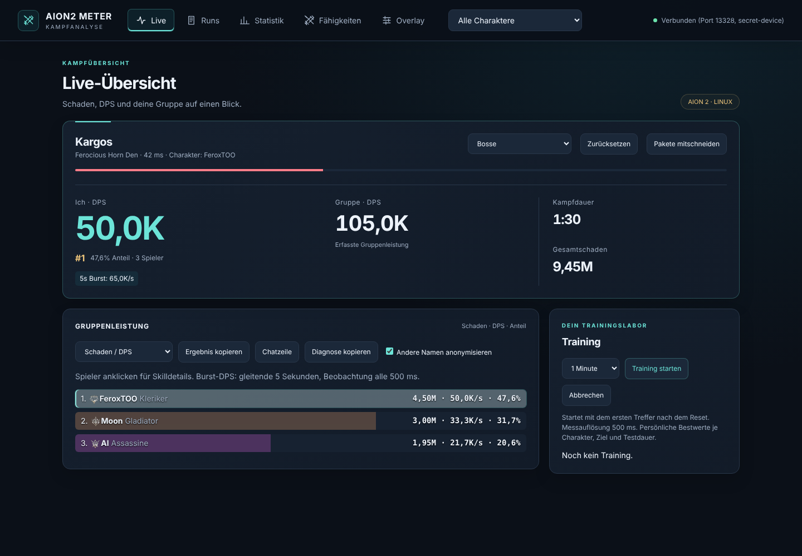

**Live nachher**

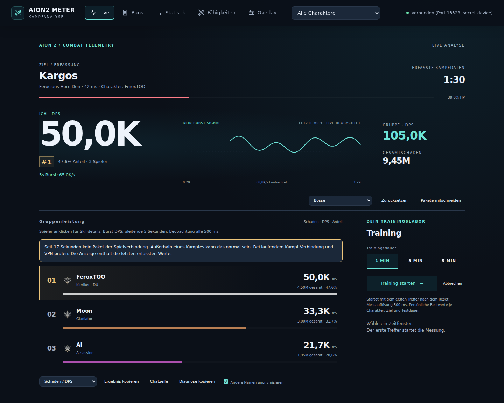

[320-Pixel-Ansicht](telemetry-images/after-live-mobile.png) · [Aether](telemetry-images/after-live-aether.png) · [Ember](telemetry-images/after-live-ember.png)

**Gespeicherter Versuch und gefüllter Kampfbericht**

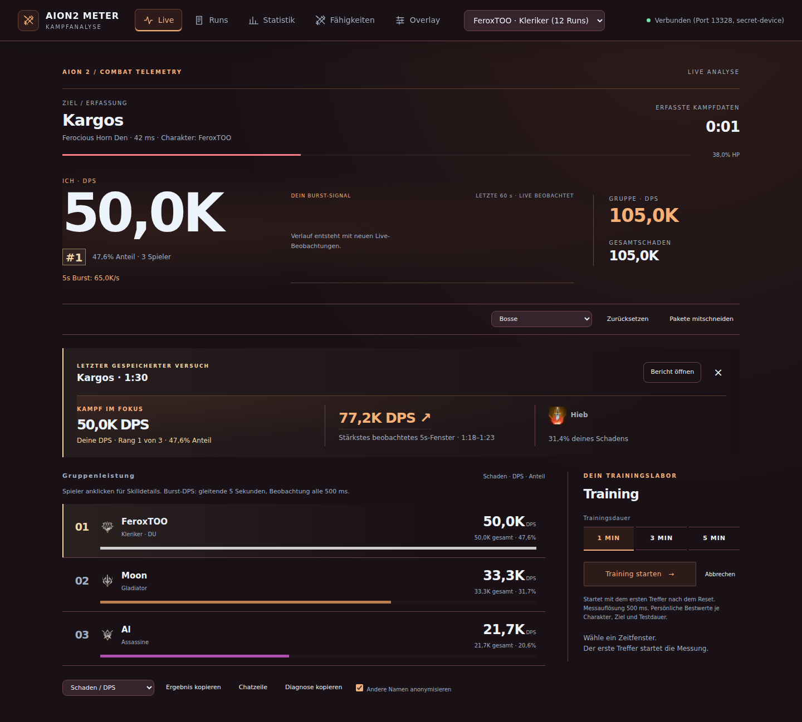

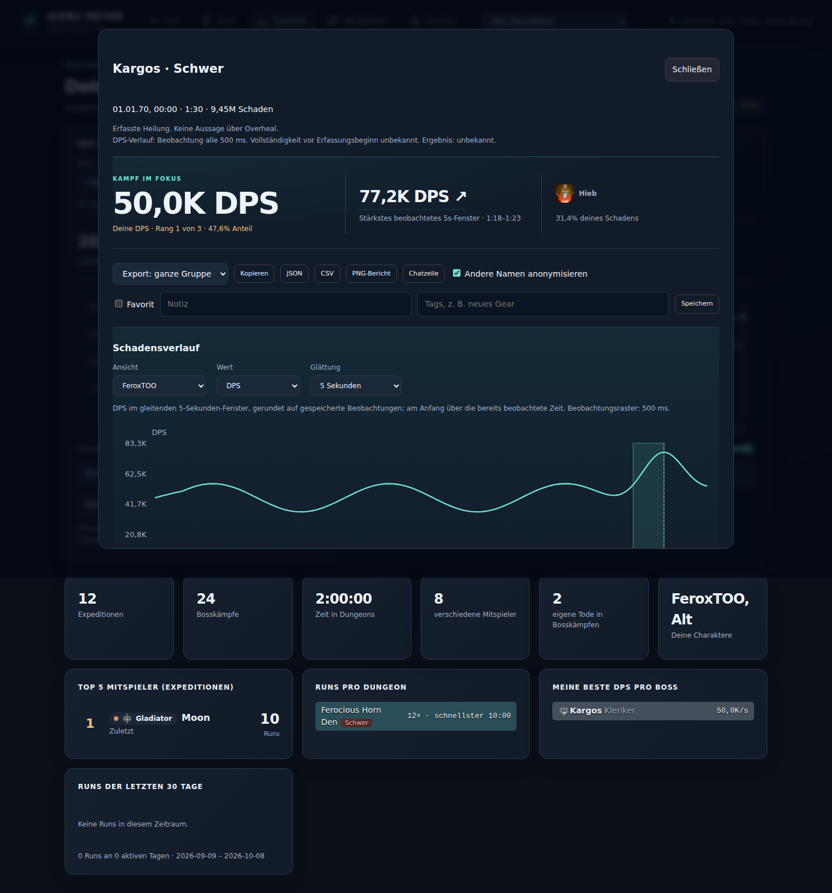

[Training mit bestätigtem Bestwert](telemetry-images/after-training.png). Alle Theme-/Mobile-/PNG-Bilder stehen zusätzlich im CI-Artefakt `web-screenshots`.

**Natives Fenster vorher**

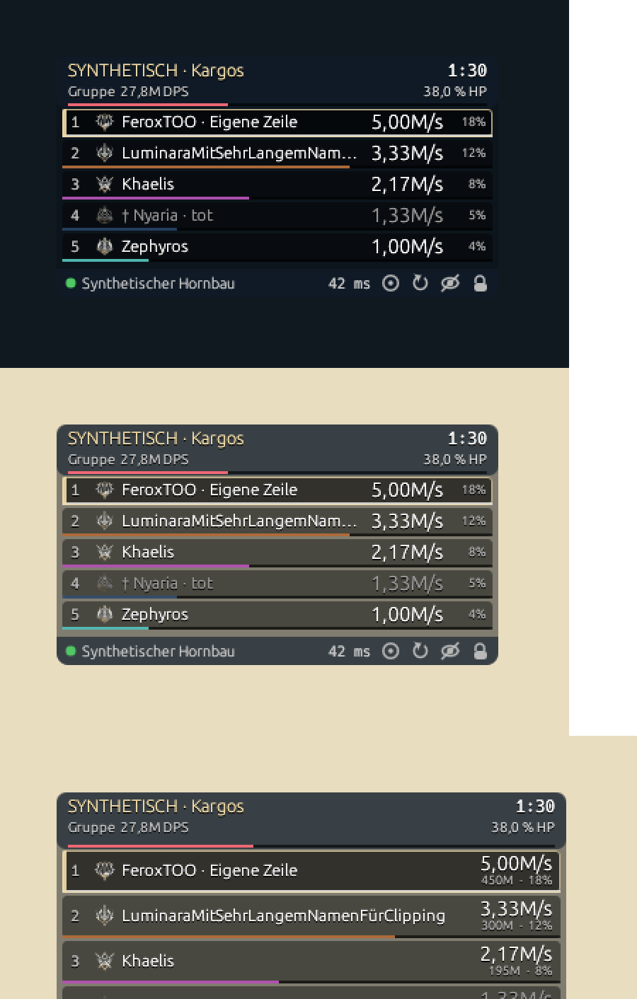

**Bestehendes natives Fenster nachher, auf weißem Untergrund**

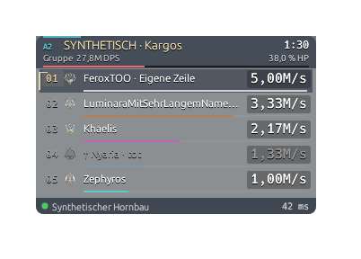

[Normale Zeilen vor farbigem QA-Untergrund](telemetry-images/after-native-effects.png). Alle Skalierungen, Themes und Untergründe stehen im Artefakt `native-screenshots`; reale Release-Browseraufnahmen unter `production-browser-screenshots`.

## Geänderte Dateien dieses PRs

| Datei | Zweck |
|---|---|
| `web/index.html` | Combat-Strip, asymmetrische Leistungsfläche, offene Rangliste und vorhandene Trainingsdauer als Radioauswahl |
| `web/enhancements.css` | Instrument-/Ranking-/Report-/Trainingshierarchie, gemeinsame drei Themes, mobile Anordnung und kurze Zustandsreaktionen mit Reduced Motion |
| `web/enhancements.js` | Begrenzte lokale Burst-Beobachtungen, stabile gespeicherte Zusammenfassung, Trainingsdarstellung, Rangreaktion und modalgebundener Peak-Sprung |
| `web/overlay.html` | Konsistente separate OBS-Darstellung, kompakte Werte, A2-/Eigenakzent und Zahlengrenzenstatus |
| `src/overlay.rs` | Bestehender Painter: offene Zeilen, Zahlenunterlagen, Rang-/Eigenakzent, Zielheader, Hover-Aktionen und kritischer Footer; Formatierung |
| `scripts/test-insights.cjs` | Ergänzte Begrenzungs-/Identitätsprüfungen des lokalen Signals |
| `scripts/test-web.cjs` | Gespeicherter Versuch, Trainingszustände, konsistenter gefüllter 90s-Bericht, Theme-/Mobile-/Peak-Prüfungen, Nullreihe und aktualisierte OBS-Geometrie |
| `scripts/test-native.py` | Neue Zeilengeometrie, ausreichend großer virtueller Bildschirm, weiße und farbige Compositor-Unterlagen |
| `README.md` | Bedienung und Link zu dieser Abschlussmatrix |
| `docs/COMBAT-TELEMETRY-ACCEPTANCE.md` | Ergebnis, Daten-/Testgrenzen, Matrix, Iterationsnachweise und vollständige Dateiliste |
| `docs/INGAME-PREMIUM-ACCEPTANCE.md` | Zusätzliche reale Abnahme für Signal, gespeicherten Versuch und Trainingszustände |
| `docs/telemetry-images/*.png` | Unveränderte Vorher-Referenzen und echte gerenderte Nachher-Evidenz |

Die zeitweise in CI genutzte automatische Rustformatierung war nur eine Arbeitsunterstützung ohne lokalen Rust-Compiler. Sie wurde entfernt; das bestehende `cargo fmt --all --check` bleibt ein echter Gate. Keine neuen Laufzeitabhängigkeiten, keine Parser-, SQL- oder Schemaänderung dieses PRs.

## Releaseurteil und Restrisiken

**Technisch freigabefähiger Release-Kandidat; reale Ingame-Abnahme offen.** In den überprüften Softwarepfaden bleiben keine bekannten offenen P0-/P1-Fehler, die ohne reale Kampfdaten reproduzierbar und noch lösbar wären. Der PR wird zur Prüfung veröffentlicht und nicht automatisch gemergt.

Die [separate reale Ingame-Abnahme](INGAME-PREMIUM-ACCEPTANCE.md) bleibt offen. Reale Protokollgenauigkeit, Spiel-/Vollbild-/KDE-/Wayland-Verhalten, menschliche Lesbarkeit während eines Kampfes und lange echte Sitzungen benötigen unabhängige Nachweise. Parser-Zahlengrenzen, fehlende Pakete und gekürzte Verläufe sind weiterhin Einschränkungen. Eine kurze synthetische History-Probe ist keine garantierte Latenz und kein Langzeitbeweis.

## Unabhängige Gegenprüfung und Nachbesserung

Nach dem dokumentierten Stand `14547d6` wurde der PR unabhängig gegengeprüft und auf demselben Branch ergänzt. Vergleichsbilder links PR-Stand, rechts nach der Gegenprüfung, identische synthetische Daten:

- **Leistungsblock live:** goldener Rang-Chip, Anteilsband der ganzen Gruppe mit markiertem eigenem Segment, Abstand zum Nachbarrang, Burst-Signal mit Fläche, Peak-Markierung und gestrichelter eigener Kampf-DPS. Steuerung in die Kopfzeile verlegt, Gruppenrate nicht mehr in Akzentfarbe.
- **Rangliste:** eine Zeile je Spieler mit Rang, Identität, Proportionsbalken, Rate und Anteilsspalte; lange Namen enden mit „…“.
- **Nachkampf und Kampfbericht:** Vergleich mit früheren Versuchen desselben Bosses, derselben Schwierigkeit, desselben Charakters und derselben Klasse (ohne Training, ohne Parser-Zahlengrenze, nur zeitlich frühere Versuche): Ø, vorheriger Versuch, Bestwert oder neuer Bestwert. Peak-Zelle mit Mini-Verlauf und markiertem Fenster, Zeiten einheitlich als m:ss,s, Peak im Diagramm beschriftet.
- **Statistik:** Trendaussage (Ø der letzten 3 gegenüber den 3 davor) nur unter den bestehenden Vergleichbarkeitsregeln, Skala über den Bereich der Versuche, gleitender Ø über 3 Versuche, Kennzahlen als ruhige Leiste.
- **Natives Overlay und OBS:** Glyphenkontur statt Zahlenplatten, goldener Rang-Chip und auslaufende Goldspur für die eigene Zeile, Klassenbalken mit kurzem Schein, Klassensymbole auf dunkler Scheibe, HP-Leiste an der Kopfkante, REC-Punkt im Kopf, Footer nur bei Bedarf. Themes unterscheiden sich in Grund, Akzent und Eckform. OBS mit deutschem Dezimalkomma.

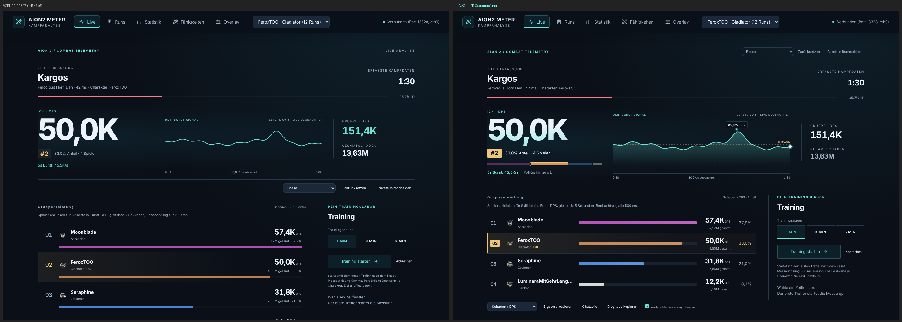
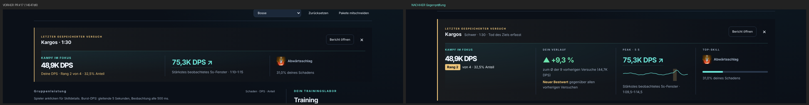
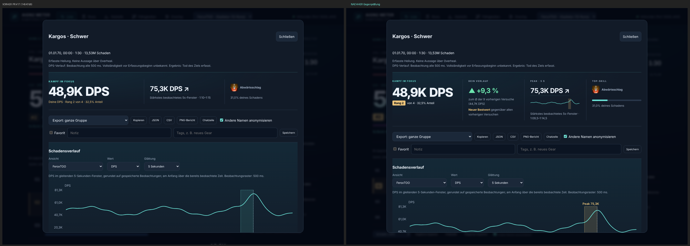
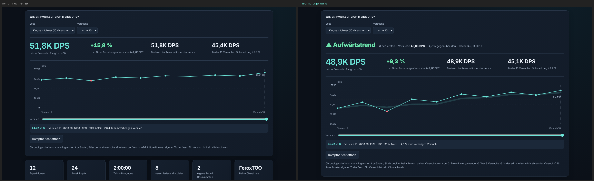
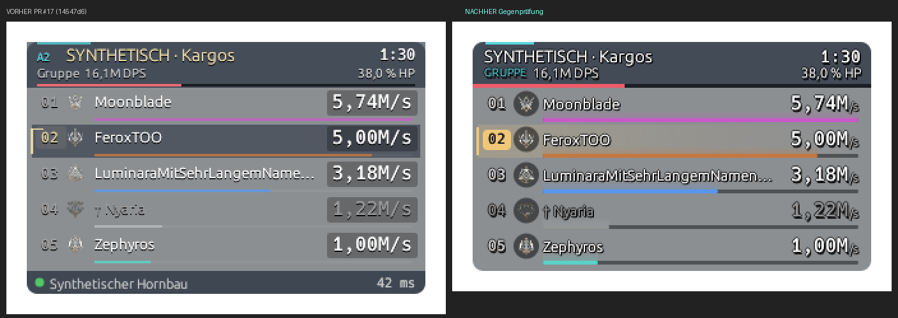
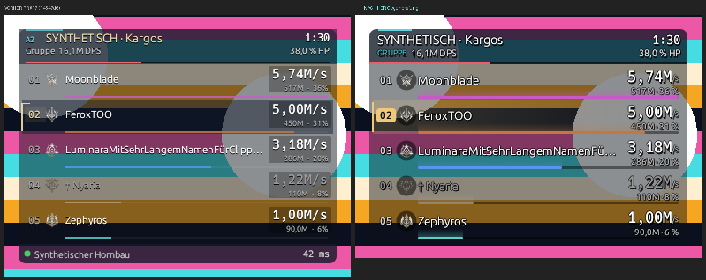
