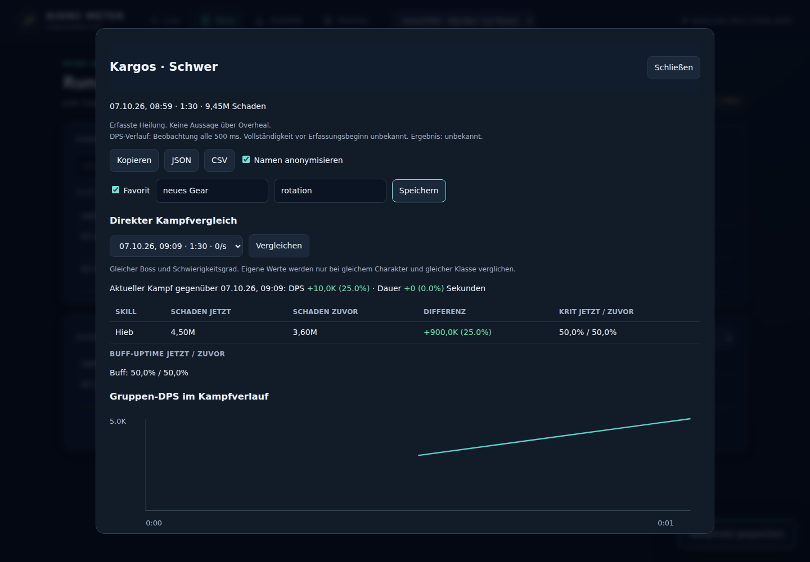

# Kampfanalyse und QoL in 0.2.0

> Historische Prüfung/Funktionsbeschreibung. Den aktuellen Teststand und spätere Änderungen dokumentiert [Releaseprüfung 0.3.1](RELEASE_REVIEW_0.3.1.md).

Aufbauend auf Dashboard-Modernisierung und dem aktuellen `main`-Stand `854533c`. Die Änderungen zur Wiedererkennung der Verbindung, nachträglichen Bossbenennung, Aufzeichnung über Neustarts und den nativen Overlay-Schaltflächen bleiben enthalten.

## Umsetzung

| Vorschlag | Umsetzung |
| --- | --- |
| Persistente Einstellungen | SQLite `meta`, einschließlich Zielmodus und nativer Position. Benannte Overlay-Profile und Wiederherstellung auf [40, 40]. Profilaktionen warten auf ausstehende Änderungen. Speicherstatus und Wiederholen bei Fehlern. |
| Eigene Zeile | In nativem und OBS-Overlay sichtbar, auch wenn außerhalb der Top N. Der tatsächliche Rang wird beibehalten. |
| Live-Spielerdetails | Klick auf eine Ranglistenzeile. Schadens- und Heilungsskills, Trefferarten, Trefferzeitpunkte und Aktualisieren. |
| Heilung und erlittener Schaden | Ranglisten auswählbar, auch im Overlay. Reine Heiler erscheinen bei vorhandenen Heilungsdaten. Gruppenheilung wird nicht erneut zu den Skillwerten addiert. |
| Kopieren / Export | Ranglisten als Text mit der ausgewählten Kennzahl und Reihenfolge, Kampfberichte als CSV/JSON. Anonymisierung standardmäßig für Kampfexporte. CSV-Zellen schützen gegen Formelausführung. Exporte verwenden eine Feldauswahl. |
| Kampfsuche | Boss/Notiz/Tag, Zeitraum, Charakter, Favoriten, Pagination. Kämpfe ohne Run und Training sind erreichbar. |
| Direkter Vergleich | Boss, Dungeon-/Schwierigkeits-ID, Charakter und Klasse werden geprüft. DPS-, Dauer- und Skill-Schadensdifferenzen, Kritraten und Buff-Uptime. |
| Zusätzliche Skillwerte | Double, Frontal, Multihit, Minimum/Maximum und Schaden je Skill. Treffer/Ticks heißen bewusst nicht Casts. |
| Training | 60/180/300 Sekunden ab erstem Treffer, Abschlussbericht, persistente persönliche Bestleistung, letzter Bericht über Neustarts. |
| Burst / Zeitlinien | Fester 5s-Nenner für Burst, einschließlich der ersten fünf Sekunden. Schaden anhand kumulativer Beobachtungen mit 500ms-Takt, Trefferzeitpunkte und Ping werden gespeichert. Buff-Intervalle werden erfasst. |
| TCP / Replay | Reihenfolge, überlappende Segmente, Duplikate, Wraparound, begrenzter Puffer und explizite Lücken. Aufnahmen v3 behalten Verbindungsmetadaten, rohe Payload-Bytes und Pre-Lock-Pakete. Replay v1/v2/v3 mit Capture-Zeit und isolierter Datenbank. |

## Daten und Grenzen

- Die bisher entfernten Trefferzeitpunkte und Ping-Werte bleiben in `record_json`. Neue Tabellen `fight_annotations` und `fight_analytics` ergänzen bestehende Datenbanken. Ein Fight-Upsert verwendet keinen ersetzenden DELETE mehr, sodass Favoriten, Notizen und Analytics bei weiteren Snapshots bestehen bleiben.
- Heilung stammt aus dem Upstream-Parser und gilt seit dessen Segment-Reset. Mehrere Ziele in einem Segment können denselben Heilungsbestand zeigen. HPS nutzt die jeweilige angezeigte Kampfdauer. Effektive Heilung, Overheal und Support-DPS werden daraus nicht behauptet. Bereits gespeicherte doppelt gezählte Summen werden beim Lesen aus vorhandenen Heilungsskills neu berechnet.
- Schadenskurven sind beobachtete Intervalle. Sie sind keine exakte Aufzeichnung jedes einzelnen Schadensereignisses. Pro Target/Start maximal 14.400 Beobachtungen, im Speicher maximal 256 Serien. Kürzung, veränderte Actor-Zuordnung oder erfasste TCP-Lücken markieren die Kurve als teilweise. Vollständigkeit vor Capture-Beginn bleibt unbekannt.
- Ein Kill wird nur bei einem beobachteten Tod des Ziels angezeigt. Sonst bleibt das Ergebnis unbekannt. Ein Wipe wird nicht aus HP oder Zonenwechsel geraten.
- Buff-Zeitlinien stammen aus Anwendung/Refresh und gemeldeter Dauer. Vorzeitige Entfernung wird noch nicht dekodiert. Heilungstimestamps liefert der gepinnte Upstream nicht.
- Trainingsauswertung erfolgt auf dem 500ms-Takt. Tatsächliche Dauer wird als Nenner verwendet. Testende wird nicht als millisekundengenau dargestellt. Alte Kämpfe bekommen keine nachträglich erfundenen Zeitdaten.
- TCP-Aufnahme beginnt ohne SYN-Verfolgung mit dem ersten beobachteten Payload. Eine Lücke kann nur beim nächsten Payload wiederhergestellt werden. Replay weist am Dateiende noch gepufferte Bytes separat aus. Fehlende Daten werden nicht ersetzt.
- V1-Dateien besitzen keine Sequenz-/Host-Metadaten. Ihr Replay verwendet je Server-Port die vorhandene Reihenfolge und nennt diese Einschränkung im Bericht. Eine große Datei wird Datensatz für Datensatz gelesen, mit Längenlimits (v3: 64 KiB Header, 2 MiB Payload; v2: 8 MiB JSON, 2 MiB dekodierte Payload). In v2 bleibt das Payload-Feld Pflicht; v3 liest die Bytes nach dem Header. Rückwärts laufende Zeitstempel halten die Replay-Zeit bis zum Aufholen an. `clock_steps_back` zählt die Rücksprünge gegenüber dem vorherigen Paket, `clock_clamped_packets` die angeglichenen Pakete. JSON-Ausgabe enthält lokale Analyseinformationen und ist nicht anonymisiert.
- Die native Position hängt weiterhin von den Regeln des Wayland-Compositors ab. Ein echter Spielkampf unter Proton und der native Fenstertest auf KDE bleiben Vor-Ort-Prüfungen.

## Validierung

55 Rust-Tests prüfen unter anderem den gespeicherten Overlay-Zustand nach Neustart, Profile, tatsächlichen Rang der eigenen Zeile, Trainingsabschluss/Bestwert, Live-Heilung und Burst aus Parser-Aggregaten, Datenbank-Upserts mit Favoriten/Analytics, reine Heiler, Suche, neue API-Aktionsguards, TCP-Wraparound/Überlappung/Duplikate und Capture-Roundtrip/Truncation, v2/v3-Kompatibilität, leere Payloads, Uhrzeitsprünge und V1-Portwechsel sowie Unicode-Grenzen für Profilnamen, Notizen und Tags.

19 Chromium-Prüfungen umfassen die vorhandenen Dashboard-Regressionsfälle plus Heilungsrangliste, Live-Skills, Trainingsaktion, Kampfvergleich, Annotationen, Diagramme, anonymisierte Exporte, CSV-Download, Formelschutz, mobiles Dialoglayout und eigene Zeile im OBS-Overlay. Zusätzlich: ausstehende Settings bei Profilaktionen, Wiederholen nach Speicherfehlern, veraltete Settings-Antworten, Escape während Live-Aktualisierung, Ranglisten-Kopieren für alle Kennzahlen und überholte Vergleichsanfragen. Die Screenshots verwenden synthetische Daten.

Der Binary-Smoke-Test startet die echte Release-Binary, prüft API und Assets, speichert Einstellungen und Profile, startet erneut, bestätigt die Persistenz und führt die Replay-CLI mit gültigen v1/v2/v3-Dateien, Uhrzeitsprüngen und ungültigen v2-Dateien aus. Build-Gates: Format, Clippy ohne Warnungen, Rust-Tests, Release, Browser und MSRV 1.88.

