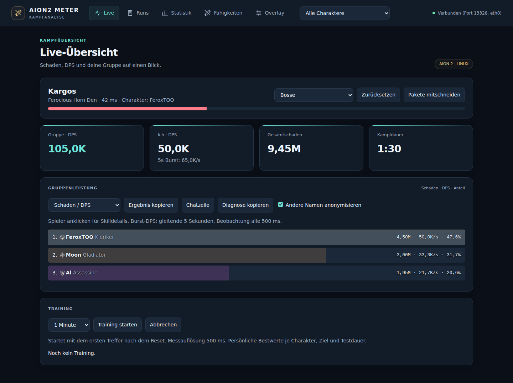
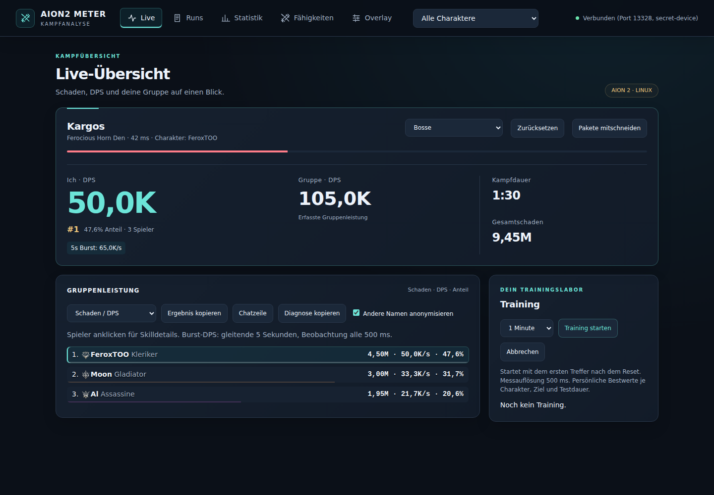
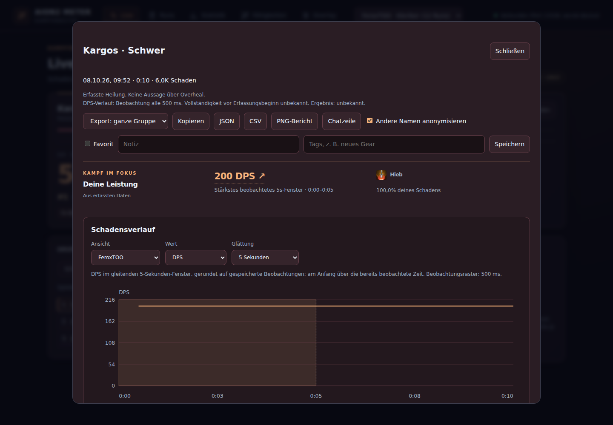
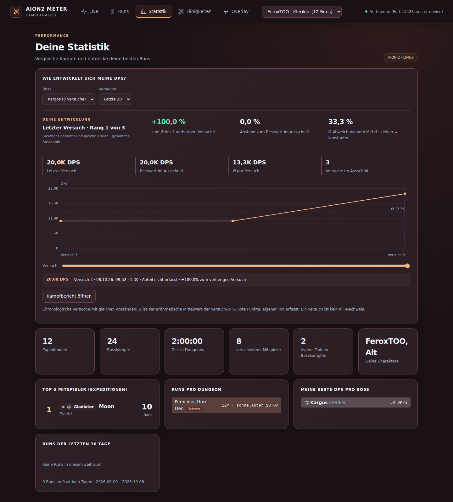
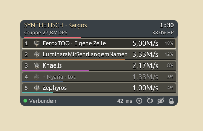

# Premium Combat Experience — technische Abnahme

Basis: main `468c08d`, Version 0.3.1. Umsetzung auf `design/premium-combat-experience`.
Die drei bestehenden Oberflächen bleiben getrennt: Dashboard `/`, natives eframe/egui-Fenster, Browser-/OBS-Ansicht `/overlay`. Es entsteht kein zusätzliches natives Overlay.

## Informationshierarchie und Signature-Bereiche

- Live: Ziel und HP, eigene Rate/Rang/Anteil, Gruppe und Zeit dominieren eine gemeinsame Fläche. Training steht daneben bzw. darunter. Diagnose, Exporte und Recording bleiben erreichbar.
- Kampfbericht: kurze datenbasierte Zusammenfassung, interaktives stärkstes beobachtetes 5s-Fenster, dazu bei Bedarf gespeicherte Skill-Treffer/Ticks. Der Zeitregler, Gruppen-/Spielervergleich, DPS/Gesamtschaden und Glättung bleiben erhalten.
- Boss-Entwicklung: persönliche Rangposition, Abstand zum Bestwert, Vergleich mit vorherigem Durchschnitt und mittlere absolute Abweichung. Bestehender Verlauf bleibt die zentrale Grafik; globale Session-KPIs sind nachgeordnet.
- Native Kompaktansicht: 312 statt 360 logische Pixel, schmale Klassenbalken, stärkere Rate, eigener Zeilenrahmen, separater Ziel-/Gruppenheader und nur bei bekannten HP ein HP-Balken. Das normale Layout zeigt weiterhin Gesamtsumme und Anteil. OBS verwendet dieselbe Hierarchie.

## Aussagegrenzen

Spitzenfenster werden nur ab fünf vollständig beobachteten Sekunden angezeigt. Kürzungen, Zähler-Rücksprünge, Lücken über drei Beobachtungsraster und Parser-Zahlengrenzen werden berücksichtigt. Ein Peak aus gekürzten Daten gilt ausschließlich für den gespeicherten Ausschnitt. Ein 5s-Fenster kann wegen des Beobachtungsrasters bis zu ein Raster länger sein; die tatsächlichen Grenzen und Dauer bestimmen die Rate.

Die Trefferliste zählt gespeicherte Zeitpunkte in `(Start, Ende]` je Spieler-ID und Skillobjekt. DoT und Multihit sind Treffer/Ticks, keine Casts. Aus Zeitpunkten wird weder Skill-Schaden im Fenster noch eine Rotation abgeleitet. Fehlende Zeitpunkte bedeuten keine bestätigte Inaktivität.

Persönliche Boss-Einordnung benötigt einen ausgewählten Charakter, mindestens drei Versuche derselben bekannten Klasse, endliche DPS-Werte und überprüfbare Records ohne erkannte Parser-Zahlengrenze. Der Vergleichs-Durchschnitt enthält nur vorherige Versuche. Bestwert und Rang gelten für den gewählten Ausschnitt und keine bestätigten Kills. Gleiche Bestwerte teilen Rang 1. Die mittlere absolute Abweichung ist eine deskriptive Konstanzzahl, keine Signifikanz oder Spielbewertung.

Keine Aussagen über Overheal, Shields, rDPS, Dispel, nicht beobachtete Buffentfernung oder reale Protokollvollständigkeit. Messwerte und Datenbankschema bleiben unverändert. Die bestehende Boss-History-API liefert zusätzlich einen aus vorhandenen Record-JSONs berechneten Zahlengrenzenhinweis; fehlende Records sperren die Einordnung. Lokale Icons, IDs, Sprachwahl und anonymisierte Exporte verwenden die bestehenden Pfade.

## Erhaltener Funktionsumfang

| Bestehender Bereich | Weitergeführt, nicht als neues System implementiert |
|---|---|
| Live | DPS/HPS/erlittener Schaden, Damage Share, eigener 5s-Burst, Zielauswahl/-HP, Kampfdauer, Diagnose/Recording/Reset |
| Training | 1/3/5 Minuten, Start mit erstem Treffer, Ergebnisse und persönliche Bestwerte je Charakter/Ziel/Dauer |
| Runs / Bibliothek | Pagination, Favoriten, Suche/Datum, Notizen/Tags, normale Mobs, historische Berichte, Run-Details und Export |
| Kampfbericht | Skilldaten, Crit/Treffer/Min/Max/Ø, Buff-/Debuff-Uptime, Zeitlinien, Einzelspieler-/Gruppenverlauf, DPS/Gesamtschaden, Glättung, Spieler-/Kampfvergleich |
| Statistik | Boss-/Schwierigkeitsauswahl, 20/50/alle Versuche, letzter Versuch/Bestwert/Ø, Zeitregler und Berichtssprung, Mitspieler, Dungeon-Runs und Aktivität |
| Katalog / Export | Stabile Skill-IDs und DoT-Unterscheidung, DE/EN-Namen, gekennzeichnete Community-Namen, unbekannte IDs, lokale Icons, CSV/JSON/PNG, Anonymisierung |
| Overlay / Settings | Ein bestehendes natives Fenster und separate OBS-Ansicht; Sichtbarkeit/Lock/Click-through, Position/Skalierung/Deckkraft/Zeilenlimit, eigene Zeile/Pinning, Kennzahl/Spalte, drei Themes, Sprache/Privacy, Profile und Zurückholen |

## Release-Abnahmematrix

Stand der letzten technischen Gegenprüfung: 8. Oktober 2026, Code-Commit `cf2dd7c09adddaf56dedb33c4088796ea1944d9a`. [CI #116](https://github.com/feroxtwo/damage-meter/actions/runs/37766245913) ist vollständig grün; der anschließende Abschlusscommit enthält ausschließlich Dokumentation und gespeicherte Prüfbilder. Verbindliche Gate-Ergebnisse stehen am [PR #15](https://github.com/feroxtwo/damage-meter/pull/15). Der CI-Lauf startet sowohl das Release-Binary als auch Chromium und das echte eframe-Fenster unter Xvfb.

| Bereich | Ausgeführt / Nachweis | Ergebnis |
|---|---|---|
| Rust / Datenpfad | `cargo fmt --all --check`, Clippy aller Targets mit `-D warnings`, 92 Rusttests, MSRV 1.88 | Bestanden |
| Neue Insight-Grenzen | 28 JS-Assertions: volle 5s-Fenster, gekürzte Baseline, Rasterlücken/Zählerreset, Parser-Caps, Actor-ID/DoT/Ticks, bekannte Klasse, vorheriger Ø und geteilte Ränge | Bestanden |
| Vorhandene Berechnungen / Export | 9 reine Chart-/PNG- und 8 Skill-/Sprach-/Export-Prüfbereiche | Bestanden |
| Browser | 49 Chromiumfälle einschließlich aller bisherigen Fälle; neuer Peak-Sprung, Trefferfenster, persönliche Einordnung, verzögerter direkter Statistik-Reload | Bestanden |
| Desktop / kleine Displays | 1440 px und 320 px; lange Namen/viele Spieler und Skills, große/gekürzte Diagramme, Tastatur/Touch, Modal-Overflow, drei Themes und reduzierte Bewegung | Bestanden, synthetische UI-Daten |
| Lokale PNGs / Sprache / Privacy | Bestehende Browserfälle exportieren und prüfen PNGs, Seitenaufteilung, lokale Icons, DE/EN und anonymisierte JSON/CSV/Chat-Ausgaben | Bestanden |
| Frischer Release / HTTP / Neustart | Release-Build und Headless-Tests: Start/Portkonflikt, API-Guards/Assets, Profile/Settings, Training, Replay und reguläres Ende | Bestanden |
| Historienlast | 5.000 Kämpfe, 500 Runs, 4 Spieler/Kampf, 140 HTTP-Anfragen mit 4 Workern; zusätzliche History-Recordprüfung ohne Schemaänderung | Bestanden; kurze Synthese, kein Langzeit-/Ingame-Benchmark |
| Native Geometrie | Release-Fenster leer und Debug-Fenster mit synthetischen Zeilen: 60/100/150/200/250 %, Position stabil, Sichtbarkeit und Neustart | Bestanden unter X11/Xvfb |
| Native Themes / Szenen | Midnight/Aether/Ember, kompakt und normal bei 100 %, helle/dunkle echte Compositor-Unterlage; 24 Zeilen zusätzlich bei 60/100/250 % | Bestanden unter X11/Xvfb, synthetische Zeilen |
| Tatsächliches Dashboard | Release-Binary mit frischer temporärer DB, Chromium ohne API-Interception: vier Ansichten, Leerzustände, Theme-Write, geordneter Shutdown | Bestanden |
| Installer / Pakete | Native Abhängigkeitsprüfung, frische Installation/Update bei laufender Binary, fehlgeschlagene Vorbereitung/Sonderpfad, Paket-/Checksumchecks | Bestanden; Paketinhalt/Metadaten, keine Installation auf sämtlichen Zielsystemen |
| Reale AION-2-Daten / KDE-Wayland | Unabhängiger Paket-/Messvergleich und Fensterverhalten im Spiel | Weiterhin offen, keine technische Ersatzabnahme |

Der [gespeicherte Historienlauf](premium-history-benchmark.json) für `cf2dd7c` dokumentiert für die Boss-History einen Median von 109,55 ms und p95 von 121,11 ms bei parallelen Anfragen; `/api/live` 1,19 ms bzw. 2,35 ms. Hostabhängige Stichprobe, keine zugesicherte Latenz. Der synthetische Record hat leere Skilllisten und belegt keine Worst-Case-JSON-Größe oder Langzeitstabilität.

Native gefüllte Szenarien verwenden ausschließlich im Debug-Build `A2M_NATIVE_FIXTURE`, maximal 24 synthetische Zeilen. Das vorhandene Fenster und derselbe Painter werden geprüft. Release-Builds enthalten diesen Eingang nicht; Paketparser und HTTP-API werden damit nicht injiziert. Der Hintergrund-Test nutzt Picom plus einen echten Root-Pixmap-Wechsel. Ein erster Aufbau mit bloßem Root-Farbwechsel wurde verworfen, weil der Compositor den Hintergrund nicht übernahm; diese Teilprüfung wurde ausdrücklich nicht als bestanden gemeldet.

## Zweite Design-/UX-Runde und Screenshot-Evidenz

Die erste Sichtprüfung führte zu drei gezielten Korrekturen: Auf kleinen Displays stehen Wartungsaktionen hinter den Leistungszahlen und die Navigation bleibt in einer kompakten Zeile; die eigene Peak-Aussage springt direkt zur passenden Spieleransicht; native Raten sind deutlicher gewichtet und abgeschnittene Namen im entsperrten Fenster per Tooltip lesbar. Keine Animation pro Live-Update. Fokus, Hover und reduzierte Bewegung werden geprüft.

**Vorher: vorhandener geprüfter Stand `b7910b1`, in main `468c08d` enthalten.** Die nachfolgende Main-Änderung betrifft Resize-Drosselung. Die gespeicherte Referenz wurde wiederverwendet, keine erneute Baseline-Testserie.

**Nachher: synthetisches Live-Dashboard.**

Die [320-px-Ansicht](review-images/premium-live-mobile.png) zeigt dieselbe Reihenfolge auf einem kleinen Display.

**Nachher: Kampfzusammenfassung mit persönlichem Peak-Sprung.**

**Nachher: persönliche Entwicklung für einen vergleichbaren synthetischen Boss-Ausschnitt.**

**Nachher: bestehendes natives Fenster vor synthetisch heller Szene.** Die ältere native Leeransicht steht weiter unter [actual-native.png](review-images/actual-native.png); sie ist keine Vergleichsmessung mit denselben gefüllten Daten.

Weitere Desktop-/320-px-Aufnahmen, alle Themes, Statistiken, OBS, PNG-Berichte und native Skalierungen stehen in den CI-Artefakten `web-screenshots`, `native-screenshots` und `production-browser-screenshots`. Es handelt sich um echte gerenderte Oberflächen mit ausdrücklich synthetischen Kampfdaten, keine Design-Mockups oder Ingame-Screenshots.

## Geänderte Dateien

| Datei | Zweck |
|---|---|
| `web/index.html` | Gemeinsame Live-Leistungsfläche, eigener Rang/Anteil, Boss-Insights vor Session-KPIs, gegliederte vorhandene Settings, sichere Script-Initialisierung |
| `web/enhancements.js` | Qualifizierte Peak-/Boss-Insights, Sprung von Zusammenfassung zum eigenen Peak, lazy Trefferfenster, Live-Rang und vergleichbare Kohorten |
| `web/enhancements.css` | Gemeinsame Premium-Designsprache, drei Theme-Akzente, Flächenhierarchie, schlanke Klassenbalken, Chart-/Tabellenzustände, mobile Reihenfolge/Navigation und Reduced Motion |
| `web/overlay.html` | Separate OBS-Ansicht mit Gruppenzeile, dominanter Rate, sekundärer Summe/Anteil und 312-px-Kompaktmodus |
| `src/overlay.rs` | Bestehender eframe-Painter: kompakte Geometrie, Ziel-/HP-Hierarchie, Zahlen/Zeilen/Tot-Status, Textschatten, private Tooltips und debug-only QA-Eingang |
| `src/db.rs` | Read-only Boss-History-Cap-Hinweis aus vorhandenen Records; Regression für normale, begrenzte und fehlende Records |
| `scripts/test-insights.cjs` | Numerische Grenzen, stabile Actor-IDs/DoT, vergleichbare persönliche Einordnung und unveränderte gespeicherte Daten |
| `scripts/test-web.cjs` | Vier zusätzliche Browserfälle, Peak-/Story-/Tick-Verbindung, Themes/mobile Darstellung, direkte Reload-Race und neue Screenshot-Evidenz |
| `scripts/test-native.py` | Leere und gefüllte echte Fenster, Skalierungen/Position/Neustart, Theme-/Compositor-Szenen und 24 Zeilen |
| `scripts/test-headless.py` | Stabiler HTML-Metrikanker statt eines durch das Design geänderten statischen Labels |
| `package.json` | Neue Insight-Prüfung in vorhandenen Testlauf aufgenommen; keine neue Laufzeitabhängigkeit |
| `.github/workflows/ci.yml` | Gefüllte native QA, realer Produktionsbrowser, notwendiger History-Probe und Screenshot-Artefakte; neue Pakete nur für CI |
| `README.md`, dieses Dokument | Bedienung, Dateiliste, technische Matrix, Aussagegrenzen und Screenshotvergleich |
| `docs/INGAME-PREMIUM-ACCEPTANCE.md` | Separate, ausdrücklich ausstehende Abnahme mit realen AION-2-Daten und Spielbedingungen |
| `docs/premium-history-benchmark.json` | Unverändertes Ergebnis der kurzen synthetischen History-Probe |
| `docs/review-images/premium-*.png` | Wiederverwendete Vorher-Referenz und echte Nachher-Aufnahmen für den Review |

## Releaseurteil

**Technisch freigabefähiger Release-Kandidat; reale Ingame-Abnahme offen.** Die vorhandenen Regressionen und die ergänzten Prüfungen bestehen. In den geprüften Softwarepfaden sind keine bekannten offenen P0-/P1-Fehler übrig, die unabhängig von realen Kampfdaten reproduzierbar und noch lösbar wären. Der PR wird nicht automatisch gemergt.

Restrisiken bleiben reale Parser-/Protokollgenauigkeit, fehlende oder gekürzte Beobachtungen, vorhandene 32-Bit-Grenzen einzelner Parser-Skills sowie KDE-/Wayland-, Vollbild- und Monitorverhalten. Neue Insights werden bei nicht überprüfbaren Daten unterdrückt oder auf den gespeicherten Ausschnitt beschränkt. Die kurze History-Probe und Xvfb-Szenen ersetzen weder eine lange Spielsitzung noch Zielsystemtests.

Optisch und rational wurde die zweite Runde anhand der gerenderten Ansichten abgeschlossen. Die Hierarchie priorisiert Daten, die Zusammenfassung führt zu ihren Beobachtungen und der native Kompaktmodus reduziert die Fläche. Lesbarkeit in weniger als einer Sekunde unter realen Spielbedingungen ist eine menschliche Ingame-Abnahme und wird nicht aus automatisierten Screenshots behauptet.

## Separate reale Ingame-Abnahme — weiterhin offen

Die [separate Ingame-Abnahmeliste](INGAME-PREMIUM-ACCEPTANCE.md) enthält die offenen Schritte und die erforderlichen Nachweise. Kein Punkt daraus wird durch diese technische Prüfung als erledigt behandelt.

Technische Freigabe ist keine bestätigte Ingame-Genauigkeit und keine bestätigte Lesbarkeit in weniger als einer Sekunde unter Spielbedingungen.
