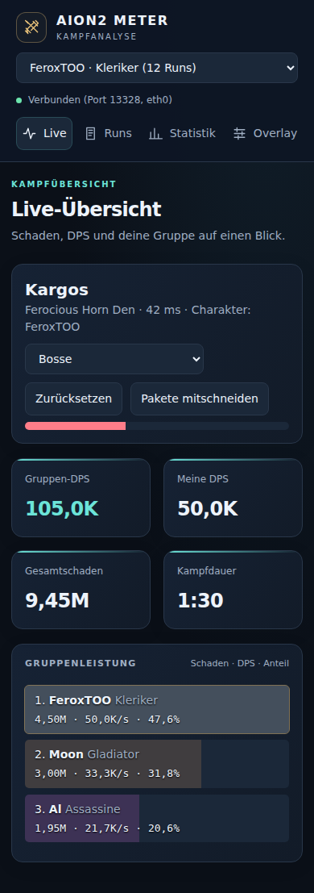

# Technische Prüfung und Modernisierung

> Historische Prüfung/Funktionsbeschreibung. Den aktuellen Teststand und spätere Änderungen dokumentiert [Releaseprüfung 0.3.1](RELEASE_REVIEW_0.3.1.md).

Ausgangsstand: `e241797` auf `main`. Geprüft wurden Paketaufnahme, Dispatcher, Engine, SQLite-Historie, HTTP-API, natives Overlay, Browser-Overlay, Dashboard und Build-Konfiguration.

## Behobene Befunde

| Bereich | Befund | Änderung |
| --- | --- | --- |
| Erfassung | Gleiche TCP-Ports verschiedener Hosts oder Schnittstellen konnten denselben Parser verwenden. Der Verbindungs-Lock ließ auch fremde Verbindungen zum gleichen Server-Port durch. | Verbindungen werden mit beiden IP-Adressen, beiden Ports und der Schnittstelle identifiziert. Beide Richtungen werden explizit zugeordnet. |
| Erfassung | Unvollständige IP-Datagramme und IPv4-Fragmente wurden als vollständige TCP-Payloads weitergegeben. | Ungültige Längen und Fragmente werden verworfen. IPv4-Offloading mit Längenfeld 0 bleibt unterstützt. |
| Dispatcher | Kandidaten für Spielverbindungen konnten unbegrenzt wachsen. Zustandswechsel warteten auf das nächste Paket. | Kandidaten laufen nach drei Sekunden ohne Signatur ab, maximal 128 Verbindungen. Der Dispatcher prüft den Zustand auch bei ruhigem Netzwerk alle 500 ms. |
| Mitschnitt | Dateien konnten vor dem Verbindungs-Lock angelegt werden. Nach Verbindungsabbruch blieb der Dateistatus aktiv. | Mitschnitte warten auf eine erkannte Spielverbindung. Bei Abbruch werden Datei und Status geschlossen. Bestehende Dateien werden nicht überschrieben. |
| API | Der Header-Schutz allein verhindert kein DNS-Rebinding. Unbekannte Zielmodi wurden übernommen. CLI-Anfragen hatten kein Timeout. | Host und Port werden geprüft, Zielmodi validiert. CLI-Verbindungen und Ein-/Ausgabe haben fünf Sekunden Timeout. Antworten sind nicht cachebar und erhalten Sicherheitsheader. |
| Start | Ein belegter Dashboard-Port wurde im Hintergrundtask gemeldet, während das native Overlay weiter starten konnte. | Der Port wird vor Start der Capture-Threads und des Overlays gebunden. Ein Fehler beendet den Start mit verständlicher Meldung. |
| Dashboard | Überlappende Anfragen konnten alte Filterdaten anzeigen oder dieselbe Seite mehrfach anhängen. Slider-Antworten konnten neuere Änderungen überschreiben. | Fortlaufende Request-IDs, gesperrte Pagination, serielles Polling mit Timeout und verzögertes, geordnetes Speichern der Einstellungen. |
| Dashboard | Fehlgeschlagene Aktionen hatten kein sichtbares Feedback. Ein unbekannter URL-Tab zeigte keine Ansicht. | Statusmeldungen, Lade- und Fehlerzustände sowie Rückfall auf Live. |
| Browser-Overlay | Namensmaskierung, Sichtbarkeit, Größe, Deckkraft und DPS-Spalte wurden ignoriert. | Die Einstellungen werden angewendet. Kurze Namen werden ebenfalls maskiert, andere Namen HTML-escaped. Bei Verbindungsfehlern werden alte Kampfreihen entfernt. |
| Natives Overlay | Lange Namen konnten Zahlen überzeichnen. Kurze Namen blieben trotz Streaming-Modus sichtbar. | Text wird vor der Zahlenspalte abgeschnitten. Auch ein- und zweistellige Namen werden maskiert. Capture-Fehler werden angezeigt. |
| Statistik | Trainings-Tode wurden als eigene Tode in Bosskämpfen gezählt. | Die Statistik schließt Trainingskämpfe aus, auch bei Charakterfiltern. |
| Build | Das Anwendungs-Repo ignorierte Cargo.lock. CI prüfte weder Lints noch Browser-Verhalten. | Rust- und Browser-Abhängigkeiten sind festgeschrieben. CI prüft Format, Clippy, Tests, Release-Build, Browser und Rust 1.88. |

## Oberfläche

Das Dashboard bleibt ohne externe Fonts, CDNs oder ein Frontend-Framework verwendbar. Neue Live-Kennzahlen, einheitliche SVG-Symbole, klarere Gruppenbalken, sichtbare Fokusmarkierungen und horizontal scrollbarere Datentabellen erleichtern die Bedienung. Die Navigation funktioniert auch mit 320 Pixeln Breite. Das native Overlay bleibt kompakt und ohne Fensterrahmen.

Vorschau mit synthetischen Testdaten:

## Validierung

- 30 Rust-Tests, einschließlich API-Schutz, Verbindungsidentität, IPv4/IPv6-Längen, Streaming-Namen und Trainingsstatistik.
- 9 Chromium-Browserprüfungen: Live-Kennzahlen, ungültige URL-Tabs, Pagination, verspätete Filterantworten, API-Fehler, Slider-Reihenfolge, 320/390-Pixel-Ansichten aller Tabs, OBS-Einstellungen und leerer Kampfzustand.
- `cargo fmt --all --check`, `cargo clippy --locked --all-targets -- -D warnings`, `cargo test --locked`, `cargo build --release --locked`.
- `cargo +1.88.0 check --locked` bestätigt die deklarierte Rust-Mindestversion.
- Ein Smoke-Test der tatsächlichen Release-Binary prüft den Start ohne Spiel/Overlay, einen belegten Port, Dashboard, API-Schutz und `ctl status`.
- Desktop- und Mobil-Screenshots wurden visuell geprüft.

Ein inkrementeller LTO-Linkversuch mit Rust 1.99 schlug in egui fehl. Nach dem gezielten Neubau dieser Abhängigkeit waren auch nachfolgende Release-Builds erfolgreich.

## Verbleibende Grenzen und nächste Schritte

- Ein echter Kampf unter AION 2/Proton und die Fensterpositionierung beziehungsweise Klickdurchleitung unter KDE Wayland wurden hier nicht getestet. Browserprüfungen verwenden API-Testdaten.
- Seit 0.2.0 ordnet ein vorgeschalteter TCP-Reassembler Payloads, entfernt Duplikate und meldet Lücken. Aufnahme und Replay behalten Sequenznummern. Details und verbleibende Grenzen: [Kampfanalyse und QoL](COMBAT_ANALYSIS.md).
- Seit 0.2.0 werden Overlay-Einstellungen und Position in SQLite gespeichert. Benannte Profile und eine Rückholfunktion stehen im Dashboard bereit.
- `--listen 0.0.0.0` stellt weiterhin eine API ohne Anmeldung ins Netzwerk. Der Host-Schutz ersetzt keine Anmeldung. Der Standard bleibt `127.0.0.1`. Bei Netzwerkzugriff ist die IP-Adresse des Rechners zu verwenden, keine frei auflösbare Domain.
- IPv6-Extension-Header und IP-Fragment-Reassembly bleiben nicht unterstützt. Solche Pakete werden nicht als vollständige Kampfpakete interpretiert.
